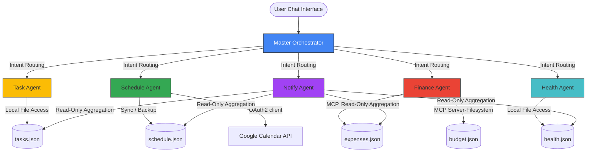

# LifeOS — AI Personal Life Manager Agent

> Your intelligent personal assistant that manages tasks, schedule, finances, and health — all in one secure, local-first chat.

---

## 1. Problem Statement — Why LifeOS Exists

In today's fast-paced digital world, personal life management is highly fragmented. Users are forced to juggle multiple separate applications: calendar apps, task managers, expense trackers, and health loggers. This fragmentation causes:
* **Cognitive Fatigue**: Constant context switching between multiple apps with disparate interfaces.
* **Siloed Data**: Inability to see how tasks, schedule events, expenses, and health metrics correlate.
* **Lack of Automation**: No single source of truth that can synthesize daily routines, finances, and fitness logs into a cohesive daily brief.
* **Privacy Vulnerabilities**: Standard personal organizers store sensitive personal, financial, and health data on remote cloud databases, exposing users to data breaches and third-party tracking.

---

## 2. Solution — What LifeOS Does

**LifeOS** addresses this fragmentation by introducing a unified, secure, local-first multi-agent ecosystem. Powered by the **Google Agent Development Kit (ADK)** and the **Gemini 2.5 Flash** model, LifeOS offers:
* **Unified Chat Interface**: Interact with tasks, schedule, finances, and health metrics in a single conversational window.
* **Intelligent AI Orchestration**: A central agent dynamically interprets user intents and routes them to specialised sub-agents.
* **Local-First Zero-Trust Security**: Verifies that all operations and files are strictly local, protecting personal records from unauthorised cloud transmission.
* **Model Context Protocol (MCP) Integration**: Safely connects with the local filesystem and real-world tools.
* **Automated Daily Summaries**: Consolidates status logs across all domains into a clean, combined morning brief.

---

## 3. Architecture

LifeOS is structured as a hub-and-spoke multi-agent system built on the Google ADK. A central **Master Orchestrator** parses the user's natural language input and delegates the task to one of the **5 specialized sub-agents**.



---

## 4. Agent Details

LifeOS features a team of six agents, each with dedicated roles, tools, and behavioral rules.

| Agent | Core Role & Responsibilities | Key Capabilities | Security & Safety Features |
| :--- | :--- | :--- | :--- |
| **Master Orchestrator** | Central router for all user requests. Handles greetings and general chat. | Parses user intents and calls `transfer_to_agent` to route requests. | Performs pre-run zero-trust path and database environment checks. |
| **Task Agent** | Manages daily todo lists. | Adds, lists, completes, sets priorities, and deletes tasks. Case-insensitive duplicate checks. | Clearing all tasks requires explicit `YES` confirmation. |
| **Schedule Agent** | Manages calendar events and meetings. | Syncs with Google Calendar API and backs up to local schedule backup. | Requires date clarification to resolve ambiguity if multiple events match a title. |
| **Finance Agent** | Logs expenditures and tracks budgets. | Adds expenses, sets budgets, and runs proactive daily budget warnings. | Clearing all logs is protected by a two-turn `YES` confirmation loop. |
| **Health Agent** | Tracks fitness and diet logs. | Logs meals, records workout durations, and computes a daily health score (1-10) with custom tips. | Strict validation on calorie ranges and workout durations. |
| **Notify Agent** | Synthesizes logs into a daily briefing. | Reads across all JSON databases to construct a formatted daily briefing. | Read-only access to files; cannot modify or delete user data. |

---

### Detailed Agent Workflows

#### 🧠 Master Orchestrator
* **Source Code**: [orchestrator/agent.py](file:///d:/capstone_project/lifeos-agent/orchestrator/agent.py)
* **Routing Rules**: Evaluates queries and transfers execution using these keywords:
  * **Task Agent**: `tasks`, `todo`, `task`
  * **Schedule Agent**: `schedule`, `meeting`, `calendar`, `event`
  * **Finance Agent**: `finance`, `expense`, `budget`, `money`
  * **Health Agent**: `health`, `meal`, `workout`, `fitness`, `calories`
  * **Notify Agent**: `brief`, `morning`, `daily summary`
* **Greetings**: Responds to standard greetings with this exact template:
  > Hello! I am LifeOS, your personal life manager! I have 5 specialist agents ready to help you: 📋 Task Agent, 📅 Schedule Agent, 💰 Finance Agent, 🏋️ Health Agent, 🌅 Morning Brief Agent. What can I help you with today?

#### 📋 Task Agent
* **Source Code**: [task_agent/agent.py](file:///d:/capstone_project/lifeos-agent/task_agent/agent.py)
* **Storage File**: [tasks.json](file:///d:/capstone_project/lifeos-agent/task_agent/tasks.json)
* **Duplicate Prevention**: Before adding a task via [add_task](file:///d:/capstone_project/lifeos-agent/task_agent/agent.py#L98-L142), the agent checks [tasks.json](file:///d:/capstone_project/lifeos-agent/task_agent/tasks.json) case-insensitively. If a task with the same title exists, it halts and reports: `Task already exists!`.
* **Flexible Identification**: Identifies tasks by numeric ID or title (exact match or partial case-insensitive match).

#### 📅 Schedule Agent
* **Source Code**: [schedule_agent/agent.py](file:///d:/capstone_project/lifeos-agent/schedule_agent/agent.py)
* **Storage File**: [schedule.json](file:///d:/capstone_project/lifeos-agent/schedule_agent/schedule.json)
* **Google Calendar Integration**: Syncs schedule events with the user's real Google Calendar account using official credentials in [create_calendar_event](file:///d:/capstone_project/lifeos-agent/schedule_agent/agent.py#L90-L237).
* **Delete Event Date Confirmation**: If the user requests to delete an event by title in [delete_event](file:///d:/capstone_project/lifeos-agent/schedule_agent/agent.py#L316-L370) but multiple matches are found, the agent prompts: `Found X events: ... Which one would you like to delete? Please specify the date.` to avoid deleting the wrong entry.

#### 💰 Finance Agent
* **Source Code**: [finance_agent/agent.py](file:///d:/capstone_project/lifeos-agent/finance_agent/agent.py)
* **Storage Files**: [expenses.json](file:///d:/capstone_project/lifeos-agent/finance_agent/expenses.json) and [budget.json](file:///d:/capstone_project/lifeos-agent/finance_agent/budget.json)
* **Proactive Budget Alerts**: Checks daily budget limits from [budget.json](file:///d:/capstone_project/lifeos-agent/finance_agent/budget.json) in [budget_alert](file:///d:/capstone_project/lifeos-agent/finance_agent/agent.py#L59-L126) on every expense logging or query. Displays warnings if total spending exceeds the limit: 
  > ⚠️ BUDGET WARNING: Daily budget exceeded! Total spending of X exceeds your daily budget limit of Y for Z.
* **Safety Confirmation**: Clearing all logs via [clear_expenses](file:///d:/capstone_project/lifeos-agent/finance_agent/agent.py#L290-L308) requires a two-turn confirmation loop.

#### 🏋️ Health Agent
* **Source Code**: [health_agent/agent.py](file:///d:/capstone_project/lifeos-agent/health_agent/agent.py)
* **Storage File**: [health.json](file:///d:/capstone_project/lifeos-agent/health_agent/health.json)
* **Health Score Calculation**: Computes a daily Health Score out of 10 in [show_health_summary](file:///d:/capstone_project/lifeos-agent/health_agent/agent.py#L165-L278) based on:
  * **Calorie Intake**: Ideal range is 1500–2500 kcal (+2 points; too high/low drops score).
  * **Workout Duration**: Active duration >= 60 mins (+3 points), >= 30 mins (+2 points), 0 mins (-1 point).
* **Daily Custom Tips**: Generates recovery tips for intense workouts (>60 mins), digestion tips for low activity (<30 mins), and snack suggestions for high calories (>2500 kcal).

#### 🌅 Notify Agent
* **Source Code**: [notify_agent/agent.py](file:///d:/capstone_project/lifeos-agent/notify_agent/agent.py)
* **Consolidated Briefing**: Reads today's entries from [tasks.json](file:///d:/capstone_project/lifeos-agent/task_agent/tasks.json), [schedule.json](file:///d:/capstone_project/lifeos-agent/schedule_agent/schedule.json), [expenses.json](file:///d:/capstone_project/lifeos-agent/finance_agent/expenses.json), and [health.json](file:///d:/capstone_project/lifeos-agent/health_agent/health.json) in [daily_brief](file:///d:/capstone_project/lifeos-agent/notify_agent/agent.py#L61-L175) to construct a unified summary:
  * List of pending tasks with priorities.
  * Chronological schedule of events for the day.
  * Total and itemized expenditures.
  * Caloric intake and total active time.

---

## 5. How to Use — Chat Examples

### 🧠 General Conversation & Routing
* **User**: `hello`
* **LifeOS**: `Hello! I am LifeOS, your personal life manager! I have 5 specialist agents ready to help you: 📋 Task Agent, 📅 Schedule Agent, 💰 Finance Agent, 🏋️ Health Agent, 🌅 Morning Brief Agent. What can I help you with today?`

### 📋 Task Agent
* **Adding a Task**:
  * *User*: `Add buy milk to my tasks`
  * *LifeOS*: `Done! Added buy milk to your tasks ✅`
* **Duplicate Prevention**:
  * *User*: `Add buy milk to my tasks`
  * *LifeOS*: `Task already exists!`
* **Listing Tasks**:
  * *User*: `show my tasks`
  * *LifeOS*: `Here is the list of all tasks:\n- [1] buy milk (Priority: normal) [pending] ⏳ Added: 2026-06-28`
* **Completing a Task**:
  * *User*: `complete buy milk`
  * *LifeOS*: `Marked buy milk as complete ✅`

### 📅 Schedule Agent
* **Scheduling an Event**:
  * *User*: `schedule Project Review on 2026-06-29 at 14:00`
  * *LifeOS*: `Scheduled Project Review on 2026-06-29 at 14:00 ✅`
* **Viewing Schedule**:
  * *User*: `what is my schedule today`
  * *LifeOS*: `Today's Schedule (2026-06-28):\n- Meeting with Google team at 10:00 AM\n- Dentist Appointment at 03:00 PM`
* **Deleting with Ambiguity**:
  * *User*: `delete Project Review`
  * *LifeOS*: `Found 2 Project Reviews: 1) Project Review on 2026-06-29 at 14:00, 2) Project Review on 2026-06-30 at 10:00. Which one would you like to delete? Please specify the date.`

### 💰 Finance Agent
* **Logging Expenses**:
  * *User*: `log 200 for lunch`
  * *LifeOS*: `Logged ₹200.00 for lunch. Daily Total: ₹200.00. Daily spending of 200.00 is within the daily budget limit of 500.00.`
* **Proactive Budget Warnings**:
  * *User*: `log 400 for dinner`
  * *LifeOS*: `Logged ₹400.00 for dinner. Daily Total: ₹600.00. ⚠️ BUDGET WARNING: Daily budget exceeded! Total spending of 600.00 exceeds your daily budget limit of 500.00 for 2026-06-28.`
* **Clearing Expenses (Safety Gate)**:
  * *User*: `clear all expenses`
  * *LifeOS*: `Are you sure? Type YES to confirm`

### 🏋️ Health Agent
* **Logging meals and workouts**:
  * *User*: `log Chicken Salad 450 calories`
  * *LifeOS*: `Logged Chicken Salad (450 kcal) ✅`
  * *User*: `log 45 min run`
  * *LifeOS*: `Logged 45 min run ✅`
* **Health Summary**:
  * *User*: `show health summary`
  * *LifeOS*:
    ```text
    🌿 Health Summary for Today (2026-06-28) 🌿

    🍽️ Today's Meals:
    - Chicken Salad (450 kcal)
    🔥 Total Caloric Intake: 450 kcal

    💪 Today's Workouts:
    - run (45 minutes)
    ⏱️ Total Active Time: 45 minutes

    📊 Health Analysis:
    • Calorie Status: eat more
    • Workout Status: good job

    💡 Health Tip of the Day:
    Consistency is key! Keep up this fantastic balance of nutrition and physical activity. 🌟

    💧 Remember to drink 8 glasses of water today!

    🎯 Overall Health Score: 7/10
    Good effort! Keep progressing! 🌟
    ```

### 🌅 Notify Agent
* **Consolidated Briefing**:
  * *User*: `give me my morning brief`
  * *LifeOS*:
    ```text
    🌅 Good morning! Here is your daily brief for 2026-06-28:

    📋 Pending Tasks:
    - [1] Prepare Slides (Priority: high)

    📅 Today's Schedule:
    - Team standup at 09:30 AM
    - Work on coding capstone at 11:00 AM

    💰 Today's Expenses:
    - lunch: 200.0
    Total Spending: 200.0

    🍎 Health & Fitness:
    - Calories Intake: 450 kcal (Chicken Salad)
    - Workouts: 45 min active time (run)
    ```

---

## 6. MCP Servers

Model Context Protocol (MCP) servers act as standardized bridges between LifeOS agents and external system components.

### 📅 Google Calendar MCP Server
* **Source**: Google Cloud Console
* **Function**: Connects the Schedule Agent to your Google Calendar API.
* **OAuth Setup**:
  1. Go to the [Google Cloud Console](https://console.cloud.google.com/).
  2. Create a project and enable the **Google Calendar API**.
  3. Navigate to **APIs & Services > Credentials** and create an **OAuth Client ID** (Desktop Application).
  4. Download the JSON credentials file, rename it to `credentials.json`, and place it in the project root directory.
  5. During first run, the Schedule Agent launches a local web flow to request OAuth authorization. Once accepted, it writes [token.json](file:///d:/capstone_project/lifeos-agent/token.json) at root to allow persistent, headless access.

### 💾 File System MCP Server
* **Source**: Built into the Antigravity CLI environment.
* **Function**: Connects the Finance, Health, and Notify agents to their respective subdirectories to persist data in JSON format.
* **Configuration**: Leverages the official `@modelcontextprotocol/server-filesystem` package via `npx` stdio connection. Because it is pre-configured and managed by the agent runners locally, **no manual setup is required** by the user.

---

## 7. Security Features

### 👤 Human-in-the-Loop (HITL) Approval
For destructive actions (such as clearing all tasks or clearing expense files):
1. The agent intercepts the request, pauses the execution of the destructive tool, and prompts: `"Are you sure? Type YES to confirm."`
2. It writes the state to a local pending confirmation file (e.g., [pending_confirmation.json](file:///d:/capstone_project/lifeos-agent/task_agent/pending_confirmation.json)).
3. In the subsequent turn, the backend verifies if the user entered exactly `YES` (case-insensitive). If so, it completes the task; otherwise, it cancels the transaction and resets the confirmation file.

### 🛡️ Zero-Trust Data Isolation Verification
To safeguard sensitive data (finances, health logs, schedules) from leaking to cloud databases:
* A strict programmatic check [verify_local_data_isolation](file:///d:/capstone_project/lifeos-agent/orchestrator/agent.py#L27-L43) runs when loading the Orchestrator and sub-agents.
* It verifies that the database path resolves exclusively to a local disk folder.
* It blocks UNC paths (starting with `\\`) and internet protocols (`http://`, `ftp://`).
* It inspects system environment variables (such as `DB_HOST`, `DATABASE_URL`, `CLOUD_SQL_CONNECTION_NAME`). If remote configurations are set, the agent throws a `SecurityError` and halts initialization unless the host points specifically to loopback addresses (`localhost`, `127.0.0.1`, `::1`).

### 📊 OpenTelemetry Telemetry Logging
* Every agent call, including input, target action, timestamp, and result, is instrumented using the OpenTelemetry SDK in [security/telemetry.py](file:///d:/capstone_project/lifeos-agent/security/telemetry.py).
* Implemented via Google ADK lifecycle callbacks (`before_agent_callback` and `after_agent_callback`).
* Tracing spans are exported locally to [telemetry.log](file:///d:/capstone_project/lifeos-agent/security/telemetry.log), providing a tamper-proof audit trail for debugging and security auditing without exposing details to remote cloud tracers.

---

## 8. Tech Stack

* **Agent Framework**: Google ADK (Agent Development Kit)
* **LLM Engine**: Google Gemini (via `google-genai` SDK and Google AI Studio)
* **Backend Framework**: FastAPI (Python 3.10+) in [main.py](file:///d:/capstone_project/lifeos-agent/main.py)
* **Server Runner**: Uvicorn ASGI Server
* **File System Connection**: Model Context Protocol (MCP) filesystem server
* **External Integration**: Google Calendar API (v3)
* **User Interface**: HTML5 / CSS3 / Vanilla JavaScript (local index file [index.html](file:///d:/capstone_project/lifeos-agent/frontend/index.html) connecting to backend endpoints)
* **Telemetry & Observability**: OpenTelemetry SDK & Python Logging

---

## 9. Setup Instructions

Follow these step-by-step instructions to get LifeOS running locally on your machine.

### Step 1: Install Prerequisites
* **Python**: Ensure Python `3.10` or higher is installed.
* **Node.js**: Installed (for executing the filesystem MCP server via `npx`).

### Step 2: Clone the Project and Install Requirements
```powershell
# Clone the repository
git clone https://github.com/sukhman0345/lifeos-agent.git
cd lifeos-agent

# Create and activate a Python virtual environment
python -m venv venv
# On Windows:
venv\Scripts\activate

# Install dependencies
pip install fastapi uvicorn pydantic google-genai google-auth-oauthlib google-api-python-client opentelemetry-sdk
```

### Step 3: Configure Environment Variables
Create a file named `.env` in the root directory:
```env
# Map your Gemini API Key from Google AI Studio
GEMINI_API_KEY=your_actual_gemini_api_key
```

### Step 4: Set up Google Calendar OAuth Credentials
1. Go to the [Google Cloud Console](https://console.cloud.google.com/).
2. Enable the **Google Calendar API** for your project.
3. Set up your **OAuth Consent Screen** (Test user publishing, add your Gmail account to the test users).
4. Create an **OAuth Client ID** of type **Desktop App**.
5. Download the client secret JSON file, rename it to `credentials.json`, and place it in the root of the `lifeos-agent` folder as [credentials.json](file:///d:/capstone_project/lifeos-agent/credentials.json).

### Step 5: Start the Backend Server
```powershell
python main.py
```
This launches the FastAPI application on `http://127.0.0.1:8080`.

### Step 6: Launch the Web UI
Open the file [index.html](file:///d:/capstone_project/lifeos-agent/frontend/index.html) in your browser. You can start chatting with LifeOS immediately!

---

## 10. Key Concepts Demonstrated for Kaggle Evaluation

This project implements advanced engineering practices evaluated in agent benchmarks:
1. **Multi-Agent Intent Routing & Context Handoff**: Demonstrates model-driven agent handoffs (`transfer_to_agent`) to isolate domain expertise and optimize token context windows.
2. **Standardized Tool Access via MCP**: Showcases model integration with standard Model Context Protocol servers to access local resources.
3. **Stateful Safety Gates (HITL)**: Implements stateful confirmation tracking across multi-turn exchanges to safeguard against accidental data deletion.
4. **Zero-Trust Locality Audits**: Programmatically validates data paths and environment variables before initialization to block exfiltration routes.
5. **Structured Tracing & Observability**: Standardizes execution telemetry using OpenTelemetry trace spans logged to a local file for audit verification.

---

## 11. Built for

**5-Day AI Agents: Intensive Vibe Coding Course With Google — Capstone Project**
